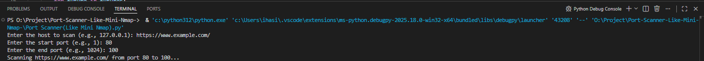

# Port-Scanner-Like-Mini-Nmap

A lightweight **port scanning tool** inspired by the functionality of Nmap.  
This project is designed to scan target systems and identify **open, closed, and filtered ports**, helping users understand network exposure and service availability.


The tool is intended for **learning, network diagnostics, and cybersecurity practice**, providing a simplified version of how professional port scanners work.

---

## Features

- Scan a **single IP address or domain**
- Detect **open and closed ports**
- **Fast TCP port scanning**
- Custom **port range scanning**
- Simple and lightweight implementation
- Beginner‑friendly interface for learning network security
- Useful for **basic penetration testing and network troubleshooting**

---

## How It Works

The scanner sends connection requests to specified ports on a target host.  
If a port responds successfully, it is marked as **open**. Otherwise, it is classified as **closed or filtered**.

Basic scanning process:

1. Target host is defined (IP or domain).
2. A range of ports is selected.
3. The scanner attempts connections to each port.
4. Results are displayed with port status.

---

## Technologies Used

- Python
- Socket Programming
- Networking Concepts (TCP/IP)

---

## Installation

Clone the repository:

```bash
git clone https://github.com/yourusername/Port-Scanner-Like-Mini-Nmap.git

Navigate to the project directory:

cd Port-Scanner-Like-Mini-Nmap

Run the scanner:

python port_scanner.py
Example Usage
python port_scanner.py --target 192.168.1.1 --ports 1-1000

Example Output:

Scanning target: 192.168.1.1
Port 22  -> OPEN
Port 80  -> OPEN
Port 443 -> OPEN
Port 21  -> CLOSED
Project Structure
Port-Scanner-Like-Mini-Nmap
│
├── port_scanner.py
├── requirements.txt
├── README.md
└── screenshots
Learning Purpose

This project helps demonstrate:

How port scanning works

Basics of network reconnaissance

Python socket programming

Foundations of cybersecurity tools

Future Improvements

Multi-threaded scanning for faster results

Service detection

OS fingerprinting

UDP scanning support

Graphical user interface (GUI)

License

This project is licensed under the MIT License.

Author

Md. Hasib Islam
Cybersecurity Enthusiast | Security Researcher